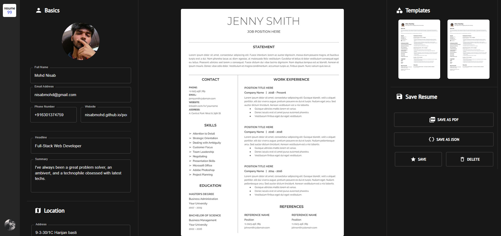

<h1 align="center">Resume Builder</h1>


##  Features
- Save To PDF
- User Friendly
- Free, forever
- No Advertising
- No User Tracking
- Straight Forward

## Overview


<br>

<br>

### Built With

- [React](https://reactjs.org/)
<!-- - [Firebase](https://firebase.google.com/) -->

## How To Use

<!-- Example: -->

To clone and run this application, you'll need [Git](https://git-scm.com) and [Node.js](https://nodejs.org/en/download/) (which comes with [npm](http://npmjs.com)) installed on your computer. From your command line:

```bash
# Clone this repository
$ git clone https://github.com/nisabmohd/resume99.git

# Install dependencies
$ npm install

# Run the app
$ npm start
```

#### <--- on built --->