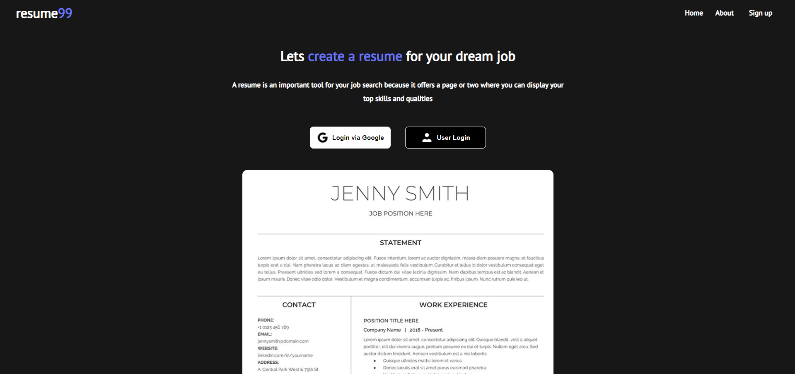

## 𝗿𝗲𝘀𝘂𝗺𝗲𝗯𝘂𝗶𝗹𝗱𝗲𝗿

<!-- #### 𝘾𝙝𝙚𝙘𝙠 𝙤𝙪𝙩 𝙩𝙝𝙚 𝙙𝙚𝙥𝙡𝙤𝙮𝙢𝙚𝙣𝙩 : https://nisabmohd.github.io/news/ -->
##  

### 𝙎𝙘𝙧𝙚𝙚𝙣𝙨𝙝𝙤𝙩𝙨 : 

 

## 𝙂𝙚𝙩𝙩𝙞𝙣𝙜 𝙎𝙩𝙖𝙧𝙩𝙚𝙙 𝙬𝙞𝙩𝙝 𝘾𝙧𝙚𝙖𝙩𝙚 𝙍𝙚𝙖𝙘𝙩 𝘼𝙥𝙥

𝙄𝙣𝙨𝙩𝙖𝙡𝙡 𝙣𝙥𝙢 𝙬𝙞𝙩𝙝 𝙉𝙤𝙙𝙚.𝙟𝙨

### `𝙣𝙥𝙢 𝗶`

## 𝘼𝙫𝙖𝙞𝙡𝙖𝙗𝙡𝙚 𝙎𝙘𝙧𝙞𝙥𝙩𝙨

𝙄𝙣 𝙩𝙝𝙚 𝙥𝙧𝙤𝙟𝙚𝙘𝙩 𝙙𝙞𝙧𝙚𝙘𝙩𝙤𝙧𝙮, 𝙮𝙤𝙪 𝙘𝙖𝙣 𝙧𝙪𝙣:

### `𝙣𝙥𝙢 𝙨𝙩𝙖𝙧𝙩`

𝙍𝙪𝙣𝙨 𝙩𝙝𝙚 𝙖𝙥𝙥 𝙞𝙣 𝙩𝙝𝙚 𝙙𝙚𝙫𝙚𝙡𝙤𝙥𝙢𝙚𝙣𝙩 𝙢𝙤𝙙𝙚.\
𝙊𝙥𝙚𝙣 [𝙝𝙩𝙩𝙥://𝙡𝙤𝙘𝙖𝙡𝙝𝙤𝙨𝙩:3000](𝙝𝙩𝙩𝙥://𝙡𝙤𝙘𝙖𝙡𝙝𝙤𝙨𝙩:3000) 𝙩𝙤 𝙫𝙞𝙚𝙬 𝙞𝙩 𝙞𝙣 𝙮𝙤𝙪𝙧 𝙗𝙧𝙤𝙬𝙨𝙚𝙧.

𝙏𝙝𝙚 𝙥𝙖𝙜𝙚 𝙬𝙞𝙡𝙡 𝙧𝙚𝙡𝙤𝙖𝙙 𝙬𝙝𝙚𝙣 𝙮𝙤𝙪 𝙢𝙖𝙠𝙚 𝙘𝙝𝙖𝙣𝙜𝙚𝙨.\
𝙔𝙤𝙪 𝙢𝙖𝙮 𝙖𝙡𝙨𝙤 𝙨𝙚𝙚 𝙖𝙣𝙮 𝙡𝙞𝙣𝙩 𝙚𝙧𝙧𝙤𝙧𝙨 𝙞𝙣 𝙩𝙝𝙚 𝙘𝙤𝙣𝙨𝙤𝙡𝙚.

### `𝙣𝙥𝙢 𝙩𝙚𝙨𝙩`

𝙇𝙖𝙪𝙣𝙘𝙝𝙚𝙨 𝙩𝙝𝙚 𝙩𝙚𝙨𝙩 𝙧𝙪𝙣𝙣𝙚𝙧 𝙞𝙣 𝙩𝙝𝙚 𝙞𝙣𝙩𝙚𝙧𝙖𝙘𝙩𝙞𝙫𝙚 𝙬𝙖𝙩𝙘𝙝 𝙢𝙤𝙙𝙚.\
𝙎𝙚𝙚 𝙩𝙝𝙚 𝙨𝙚𝙘𝙩𝙞𝙤𝙣 𝙖𝙗𝙤𝙪𝙩 [𝙧𝙪𝙣𝙣𝙞𝙣𝙜 𝙩𝙚𝙨𝙩𝙨](𝙝𝙩𝙩𝙥𝙨://𝙛𝙖𝙘𝙚𝙗𝙤𝙤𝙠.𝙜𝙞𝙩𝙝𝙪𝙗.𝙞𝙤/𝙘𝙧𝙚𝙖𝙩𝙚-𝙧𝙚𝙖𝙘𝙩-𝙖𝙥𝙥/𝙙𝙤𝙘𝙨/𝙧𝙪𝙣𝙣𝙞𝙣𝙜-𝙩𝙚𝙨𝙩𝙨) 𝙛𝙤𝙧 𝙢𝙤𝙧𝙚 𝙞𝙣𝙛𝙤𝙧𝙢𝙖𝙩𝙞𝙤𝙣.

### `𝙣𝙥𝙢 𝙧𝙪𝙣 𝙗𝙪𝙞𝙡𝙙`

𝘽𝙪𝙞𝙡𝙙𝙨 𝙩𝙝𝙚 𝙖𝙥𝙥 𝙛𝙤𝙧 𝙥𝙧𝙤𝙙𝙪𝙘𝙩𝙞𝙤𝙣 𝙩𝙤 𝙩𝙝𝙚 `𝙗𝙪𝙞𝙡𝙙` 𝙛𝙤𝙡𝙙𝙚𝙧.\
𝙄𝙩 𝙘𝙤𝙧𝙧𝙚𝙘𝙩𝙡𝙮 𝙗𝙪𝙣𝙙𝙡𝙚𝙨 𝙍𝙚𝙖𝙘𝙩 𝙞𝙣 𝙥𝙧𝙤𝙙𝙪𝙘𝙩𝙞𝙤𝙣 𝙢𝙤𝙙𝙚 𝙖𝙣𝙙 𝙤𝙥𝙩𝙞𝙢𝙞𝙯𝙚𝙨 𝙩𝙝𝙚 𝙗𝙪𝙞𝙡𝙙 𝙛𝙤𝙧 𝙩𝙝𝙚 𝙗𝙚𝙨𝙩 𝙥𝙚𝙧𝙛𝙤𝙧𝙢𝙖𝙣𝙘𝙚.

𝙏𝙝𝙚 𝙗𝙪𝙞𝙡𝙙 𝙞𝙨 𝙢𝙞𝙣𝙞𝙛𝙞𝙚𝙙 𝙖𝙣𝙙 𝙩𝙝𝙚 𝙛𝙞𝙡𝙚𝙣𝙖𝙢𝙚𝙨 𝙞𝙣𝙘𝙡𝙪𝙙𝙚 𝙩𝙝𝙚 𝙝𝙖𝙨𝙝𝙚𝙨.\
𝙔𝙤𝙪𝙧 𝙖𝙥𝙥 𝙞𝙨 𝙧𝙚𝙖𝙙𝙮 𝙩𝙤 𝙗𝙚 𝙙𝙚𝙥𝙡𝙤𝙮𝙚𝙙!

𝙎𝙚𝙚 𝙩𝙝𝙚 𝙨𝙚𝙘𝙩𝙞𝙤𝙣 𝙖𝙗𝙤𝙪𝙩 [𝙙𝙚𝙥𝙡𝙤𝙮𝙢𝙚𝙣𝙩](𝙝𝙩𝙩𝙥𝙨://𝙛𝙖𝙘𝙚𝙗𝙤𝙤𝙠.𝙜𝙞𝙩𝙝𝙪𝙗.𝙞𝙤/𝙘𝙧𝙚𝙖𝙩𝙚-𝙧𝙚𝙖𝙘𝙩-𝙖𝙥𝙥/𝙙𝙤𝙘𝙨/𝙙𝙚𝙥𝙡𝙤𝙮𝙢𝙚𝙣𝙩) 𝙛𝙤𝙧 𝙢𝙤𝙧𝙚 𝙞𝙣𝙛𝙤𝙧𝙢𝙖𝙩𝙞𝙤𝙣.

### `𝙣𝙥𝙢 𝙧𝙪𝙣 𝙚𝙟𝙚𝙘𝙩`

**𝙉𝙤𝙩𝙚: 𝙩𝙝𝙞𝙨 𝙞𝙨 𝙖 𝙤𝙣𝙚-𝙬𝙖𝙮 𝙤𝙥𝙚𝙧𝙖𝙩𝙞𝙤𝙣. 𝙊𝙣𝙘𝙚 𝙮𝙤𝙪 `𝙚𝙟𝙚𝙘𝙩`, 𝙮𝙤𝙪 𝙘𝙖𝙣'𝙩 𝙜𝙤 𝙗𝙖𝙘𝙠!**

𝙄𝙛 𝙮𝙤𝙪 𝙖𝙧𝙚𝙣'𝙩 𝙨𝙖𝙩𝙞𝙨𝙛𝙞𝙚𝙙 𝙬𝙞𝙩𝙝 𝙩𝙝𝙚 𝙗𝙪𝙞𝙡𝙙 𝙩𝙤𝙤𝙡 𝙖𝙣𝙙 𝙘𝙤𝙣𝙛𝙞𝙜𝙪𝙧𝙖𝙩𝙞𝙤𝙣 𝙘𝙝𝙤𝙞𝙘𝙚𝙨, 𝙮𝙤𝙪 𝙘𝙖𝙣 `𝙚𝙟𝙚𝙘𝙩` 𝙖𝙩 𝙖𝙣𝙮 𝙩𝙞𝙢𝙚. 𝙏𝙝𝙞𝙨 𝙘𝙤𝙢𝙢𝙖𝙣𝙙 𝙬𝙞𝙡𝙡 𝙧𝙚𝙢𝙤𝙫𝙚 𝙩𝙝𝙚 𝙨𝙞𝙣𝙜𝙡𝙚 𝙗𝙪𝙞𝙡𝙙 𝙙𝙚𝙥𝙚𝙣𝙙𝙚𝙣𝙘𝙮 𝙛𝙧𝙤𝙢 𝙮𝙤𝙪𝙧 𝙥𝙧𝙤𝙟𝙚𝙘𝙩.